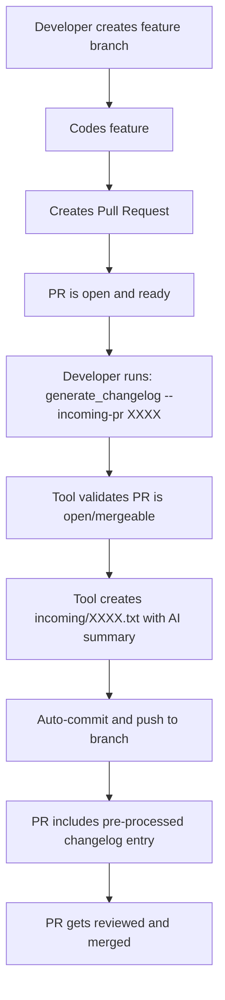
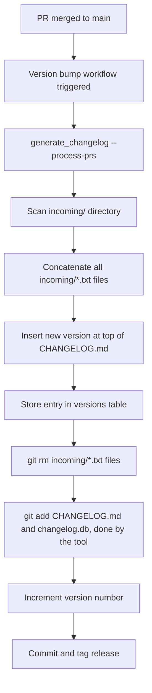

# Automated CHANGELOG Entry System for CI/CD

## Overview

This document outlines a comprehensive system for automatically generating and maintaining CHANGELOG.md entries during the CI/CD process. The system builds upon the existing `generate_changelog` tool and integrates seamlessly with GitHub's pull request workflow.

## Current State Analysis

### Existing Infrastructure

The `generate_changelog` tool already provides:

- **High-performance Git history walking** with one-pass algorithm
- **GitHub API integration** with GraphQL optimization and smart caching
- **SQLite-based caching** for instant incremental updates
- **AI-powered summaries** using Fabric integration
- **Concurrent processing** for optimal performance
- **Version detection** from git tags and commit patterns

### Key Components

- **Main entry point**: `cmd/generate_changelog/main.go`
- **Core generation logic**: `internal/changelog/generator.go`
- **AI summarization**: `internal/changelog/summarize.go`
- **Caching system**: `internal/cache/cache.go`
- **GitHub integration**: `internal/github/client.go`
- **Git operations**: `internal/git/walker.go`

## Proposed Automated System

### Developer Workflow



### CI/CD Integration



## Implementation Details

### Phase 1: Pre-Processing PRs

#### New Command: `--incoming-pr`

**Usage**: `generate_changelog --incoming-pr 1672`

**Functionality**:

1. **Validation**:
   - Verify PR exists and is open
   - Check PR is mergeable
   - Ensure branch is up-to-date
   - Verify that current git repo is clean (everything committed); do not continue otherwise.

2. **Content Generation**:
   - Extract PR metadata (title, author, description)
   - Collect all commit messages from the PR
   - Use existing `SummarizeVersionContent` function for AI enhancement
   - Format as standard changelog entry

3. **File Creation**:
   - Generate `./cmd/generate_changelog/incoming/{PR#}.txt`
   - Include PR header: `### PR [#1672](url) by [author](profile): Title` (as is done currently in the code)
   - Consider extracting the existing header code for PRs into a helper function for re-use.
   - Include the AI-summarized changes (generated when we ran all the commit messages through `SummarizeVersionContent`)

4. **Auto-commit**:
   - Commit file with message: `chore: incoming 1672 changelog entry`
   - Optionally push to current branch (use `--push` flag)

(The PR is now completely ready to be merged with integrated CHANGELOG entry updating)

#### File Format Example

```markdown
### PR [#1672](https://github.com/danielmiessler/Fabric/pull/1672) by [ksylvan](https://github.com/ksylvan): Changelog Generator Enhancement

- Added automated CI/CD integration for changelog generation
- Implemented pre-processing of PR entries during development
- Enhanced caching system for better performance
- Added validation for mergeable PR states
```

### Phase 2: Release Processing

#### New Command: `--process-prs`

**Usage**: `generate_changelog --process-prs`

**Integration Point**: `.github/workflows/update-version-and-create-tag.yml`

(we can do this AFTER the "Update gomod2nix.toml file" step in the workflow, where we
already have generated the next version in the "version.nix" file)

**Functionality**:

1. **Discovery**: Scan `./cmd/generate_changelog/incoming/` directory
2. **Aggregation**: Read and concatenate all `*.txt` files
3. **Version Creation**: Generate new version header with current date
4. **CHANGELOG Update**: Insert new version at top of existing CHANGELOG.md
5. **Database Update**: Store complete entry in `versions` table as `ai_summary`
6. **Cleanup**: Remove all processed incoming files
7. **Stage Changes**: Add modified files to git staging area

#### Example Output in CHANGELOG.md

```markdown
# Changelog

## v1.4.259 (2025-07-18)

### PR [#1672](https://github.com/danielmiessler/Fabric/pull/1672) by [ksylvan](https://github.com/ksylvan): Changelog Generator Enhancement

- Added automated CI/CD integration for changelog generation
- Implemented pre-processing of PR entries during development
- Enhanced caching system for better performance

### PR [#1671](https://github.com/danielmiessler/Fabric/pull/1671) by [contributor](https://github.com/contributor): Bug Fix

- Fixed memory leak in caching system
- Improved error handling for GitHub API failures

## v1.4.258 (2025-07-14)
[... rest of file ...]
```

## Technical Implementation

### Configuration Extensions

Add to `internal/config/config.go`:

```go
type Config struct {
    // ... existing fields
    IncomingPR   int         // PR number for --incoming-pr
    ProcessPRsVersion string // Flag for --process-prs (new version string)
    IncomingDir  string      // Directory for incoming files (default: ./cmd/generate_changelog/incoming/)
}
```

### New Command Line Flags

```go
rootCmd.Flags().IntVar(&cfg.IncomingPR, "incoming-pr", 0, "Pre-process PR for changelog (provide PR number)")
rootCmd.Flags().StringVar(&cfg.ProcessPRsVersion, "process-prs", "", "Process all incoming PR files for release (provide version like v1.4.262)")
rootCmd.Flags().StringVar(&cfg.IncomingDir, "incoming-dir", "./cmd/generate_changelog/incoming", "Directory for incoming PR files")
```

### Core Logic Extensions

#### PR Pre-processing

```go
func (g *Generator) ProcessIncomingPR(prNumber int) error {
    // 1. Validate PR state via GitHub API
    pr, err := g.ghClient.GetPR(prNumber)
    if err != nil || pr.State != "open" || !pr.Mergeable {
        return fmt.Errorf("PR %d is not in valid state for processing", prNumber)
    }

    // 2. Generate changelog content using existing logic
    content := g.formatPR(pr)

    // 3. Apply AI summarization if enabled
    if g.cfg.EnableAISummary {
        content, _ = SummarizeVersionContent(content)
    }

    // 4. Write to incoming file
    filename := filepath.Join(g.cfg.IncomingDir, fmt.Sprintf("%d.txt", prNumber))
    err = os.WriteFile(filename, []byte(content), 0644)
    if err != nil {
        return fmt.Errorf("failed to write incoming file: %w", err)
    }

    // 5. Auto-commit and push
    return g.commitAndPushIncoming(prNumber, filename)
}
```

#### Release Processing

```go
func (g *Generator) ProcessIncomingPRs(version string) error {
    // 1. Scan incoming directory
    files, err := filepath.Glob(filepath.Join(g.cfg.IncomingDir, "*.txt"))
    if err != nil || len(files) == 0 {
        return fmt.Errorf("no incoming PR files found")
    }

    // 2. Read and concatenate all files
    var content strings.Builder
    for _, file := range files {
        data, err := os.ReadFile(file)
        if err == nil {
            content.WriteString(string(data))
            content.WriteString("\n")
        }
    }

    // 3. Generate version entry
    entry := fmt.Sprintf("\n## %s (%s)\n\n%s",
        version, time.Now().Format("2006-01-02"), content.String())

    // 4. Update CHANGELOG.md
    err = g.insertVersionAtTop(entry)
    if err != nil {
        return fmt.Errorf("failed to update CHANGELOG.md: %w", err)
    }

    // 5. Update database
    err = g.cache.SaveVersionEntry(version, content.String())
    if err != nil {
        return fmt.Errorf("failed to save to database: %w", err)
    }

    // 6. Cleanup incoming files
    for _, file := range files {
        os.Remove(file)
    }

    return nil
}
```

## Workflow Integration

### GitHub Actions Modification

Update `.github/workflows/update-version-and-create-tag.yml`.

```yaml
- name: Generate Changelog Entry
  run: |
    # Process all incoming PR entries
    ./cmd/generate_changelog/generate_changelog --process-prs

    # The tool will make the needed changes in the CHANGELOG.md,
    # and the changelog.db, and will remove the PR#.txt file(s)
    # In effect, doing the following:
    # 1. Generate the new CHANGELOG (and store the entry in the changelog.db)
    # 2. git add CHANGELOG.md
    # 3. git add ./cmd/generate_changelog/changelog.db
    # 4. git rm -rf ./cmd/generate_changelog/incoming/
    #
```

### Developer Instructions

1. **During Development**:

   ```bash
   # After PR is ready for review (commit locally only)
   generate_changelog --incoming-pr 1672 --ai-summarize

   # Or to automatically push to remote
   generate_changelog --incoming-pr 1672 --ai-summarize --push
   ```

2. **Validation**:
   - Check that `incoming/1672.txt` was created
   - Verify auto-commit occurred
   - Confirm file is included in PR
   - Scan the file and make any changes you need to the auto-generated summary

## Benefits

### For Developers

- **Automated changelog entries** - no manual CHANGELOG.md editing
- **AI-enhanced summaries** - professional, consistent formatting
- **Early visibility** - changelog content visible during PR review
- **Reduced merge conflicts** - no multiple PRs editing CHANGELOG.md

### For Project Maintainers

- **Consistent formatting** - all entries follow same structure
- **Complete coverage** - no missed changelog entries
- **Automated releases** - seamless integration with version bumps
- **Historical accuracy** - each PR's contribution properly documented

### For CI/CD

- **Deterministic process** - reliable, repeatable changelog generation
- **Performance optimized** - leverages existing caching and AI systems
- **Error resilience** - validates PR states before processing
- **Clean integration** - minimal changes to existing workflows

## Implementation Strategy

### Phase 1: Implement Developer Tooling

- [x] Add new command line flags and configuration
- [x] Implement `--incoming-pr` functionality
- [x] Add validation for PR states and git status
- [x] Create auto-commit logic

### Phase 2: Integration (CI/CD) Readiness

- [x] Implement `--process-prs` functionality
- [x] Add CHANGELOG.md insertion logic
- [x] Update database storage for version entries

### Phase 3: Deployment

- [x] Update GitHub Actions workflow
- [x] Create developer documentation in ./docs/ directory
- [x] Test full end-to-end workflow (the PR that includes these modifications can be its first production test)

### Phase 4: Adoption

- [ ] Train development team - Consider creating a full tutorial blog post/page to fully walk developers through the process.
- [ ] Monitor first few releases
- [ ] Gather feedback and iterate
- [ ] Document lessons learned

## Error Handling

### PR Validation Failures

- **Closed/Merged PR**: Error with suggestion to check PR status
- **Non-mergeable PR**: Error with instruction to resolve conflicts
- **Missing PR**: Error with verification of PR number

### File System Issues

- **Permission errors**: Clear error with directory permission requirements
- **Disk space**: Graceful handling with cleanup suggestions
- **Network failures**: Retry logic with exponential backoff

### Git Operations

- **Commit failures**: Check for dirty working directory
- **Push failures**: Handle authentication and remote issues
- **Merge conflicts**: Clear instructions for manual resolution

## Future Enhancements

### Advanced Features

- **Custom categorization** - group changes by type (feat/fix/docs)
- **Breaking change detection** - special handling for BREAKING CHANGE commits
- **Release notes generation** - enhanced formatting for GitHub releases (our release pages are pretty bare)

## Conclusion

This automated changelog system builds upon the robust foundation of the existing `generate_changelog` tool while providing a seamless developer experience and reliable CI/CD integration. By pre-processing PR entries during development and aggregating them during releases, we achieve both accuracy and automation without sacrificing quality or developer productivity.

The phased approach ensures smooth adoption while the extensive error handling and validation provide confidence in production deployment. The system's design leverages existing infrastructure and patterns, making it a natural evolution of the current changelog generation capabilities.
